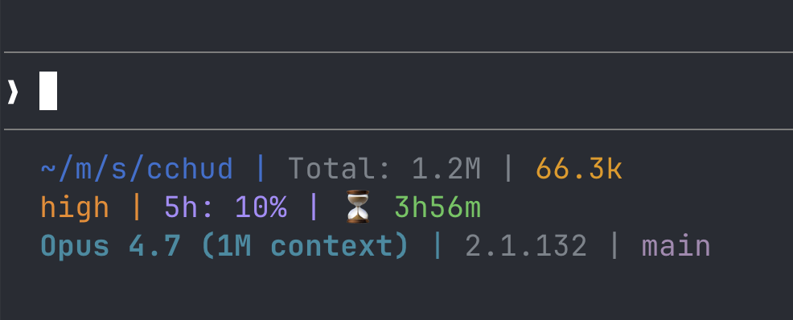

<div align="center">

# cchud

**A blazing-fast statusline for Claude Code, written in Rust.**

Drop-in replacement for [ccstatusline](https://github.com/sirmalloc/ccstatusline) — same widgets, same config, but **~50× faster cold-start** and **~20× less memory**.

[](https://github.com/IGoRFonin/cchud/actions/workflows/ci.yml)
[](https://www.npmjs.com/package/@cchud/cchud)
[](LICENSE)
[](rust-toolchain.toml)

<br>



</div>

---

## What is it?

`cchud` is the line of text Claude Code shows at the bottom of your terminal — model name, token usage, git branch, cost so far, etc. Claude Code calls the statusline binary up to **3 times per second**, so every millisecond matters.

60 widgets out of the box. Plain or Powerline rendering. Interactive TUI configurator. One-shot migration from ccstatusline.

## Why use it?

- **Fast.** ~5 ms cold-start vs ~250 ms for the Node.js original. No CPU drain in long Claude sessions.
- **Lightweight.** ~5 MB RSS vs ~100 MB. Doesn't fight your editor for memory.
- **Drop-in.** Same JSON schema as `ccstatusline`. Run `cchud import` and you're done.
- **No Node required.** Native binary. Works the same whether you `nvm use 18` or 24.
- **Beautiful.** 5 built-in Powerline themes (Dracula, Nord, Gruvbox, Solarized, Default), per-widget color overrides, OSC 8 hyperlinks.

## Install

One command — installs the binary, wires Claude Code, opens the TUI configurator:

```bash
npx -y @cchud/cchud
```

No Node? Use the install script (macOS / Linux gnu & musl):

```bash
curl -fsSL https://raw.githubusercontent.com/IGoRFonin/cchud/main/install.sh | sh
cchud
```

Both methods install to `~/.local/bin/cchud` (or `%LOCALAPPDATA%\cchud\cchud.exe` on Windows). The path is stable across `nvm use` and Node-version switches.

### Migrating from ccstatusline?

```bash
npx -y @cchud/cchud
cchud import       # auto-detects ccstatusline section in ~/.claude/settings.json
```

See [MIGRATION.md](./MIGRATION.md) for the full guide.

### Other commands

```bash
cchud configure    # open the interactive TUI
cchud doctor       # 9-check health report
cchud install      # re-wire Claude Code (idempotent)
```

---

## TUI Configurator

Run `cchud configure` to open the 4-panel interactive editor:

- **Lines** — add / remove / reorder lines and widgets (`a`, `d`, `Alt+↑↓`).
- **Palette** — 60-widget catalogue, live filter (`/`), 11 categories.
- **Settings** — per-widget overrides: color picker (16 ANSI + custom hex), background, bold.
- **Preview** — live statusbar preview on a sample payload.

**Keys:** `Tab` / `Shift+Tab` switch panels · `t` themes overlay · `?` help · `Ctrl+S` save · `q` quit.

## Performance

Hyperfine, Apple M4 Pro, release binary, cold-start, 200 iterations:

| Setup | Mean / p95 | RSS peak |
|---|---:|---:|
| `npx ccstatusline@latest` | 827.7 ms | — |
| `ccstatusline` (global install) | 246.7 ms | 97.7 MB |
| **`cchud`, 22-widget plain** | **< 5 ms** | **< 5 MB** |
| `cchud`, 21-widget git + PR cache-hit | < 8 ms | < 5 MB |
| `cchud`, 8-widget transcript cold-parse 50 MB | ~70 ms | < 5 MB |
| `cchud`, 60-widget full config | < 12 ms | < 5 MB |

Claude Code invokes the statusline up to 3×/s. With 4 parallel sessions: ccstatusline ≈ **296% of one core**, cchud ≈ **6%**.

## Supported widgets (60 / 60)

Full parity with ccstatusline 2.2.8.

| Source | Widgets |
|---|---|
| Payload (fast) | `model`, `version`, `claude-session-id`, `terminal-width`, `output-style`, `vim-mode`, `session-name`, `session-clock`, `session-cost`, `context-length`, `context-percentage`, `context-percentage-usable`, `context-bar`, `tokens-input`, `tokens-output`, `worktree`, `worktree-mode`, `worktree-name`, `worktree-branch`, `worktree-original-branch` |
| Static (config) | `custom-text`, `custom-symbol`, `link` |
| Subprocess | `custom-command` (argv-style, configurable timeout, default 200 ms) |
| Git (gix) | `git-branch`, `git-sha`, `git-root-dir`, `git-status`, `git-changes`, `git-staged`, `git-unstaged`, `git-untracked`, `git-conflicts`, `git-insertions`, `git-deletions`, `git-ahead-behind`, `git-origin-owner`, `git-origin-repo`, `git-origin-owner-repo`, `git-upstream-owner`, `git-upstream-repo`, `git-upstream-owner-repo`, `git-is-fork` |
| HTTP | `git-pr` (GitHub API, disk-cached, offline-tolerant), `session-usage`, `weekly-usage`, `block-reset-timer`, `weekly-reset-timer` |
| Transcript (JSONL cache) | `tokens-cached`, `tokens-total`, `input-speed`, `output-speed`, `total-speed`, `block-timer`, `session-duration`, `thinking-effort`, `skills` |
| Env / system | `claude-account-email`, `free-memory` |

See [`docs/widgets.md`](docs/widgets.md) for the full reference.

## Configuration (manual)

`cchud install` wires cchud into `~/.claude/settings.json`. Your widget list lives in a separate file: `~/.config/cchud/settings.json` (auto-created on first run):

```json
{
  "version": 1,
  "lines": [{
    "widgets": [
      {"type": "model"},
      {"type": "session-cost"},
      {"type": "context-percentage"},
      {"type": "context-bar", "width": 10},
      {"type": "worktree-name"},
      {"type": "vim-mode"}
    ]
  }],
  "theme": {}
}
```

### Git widgets

```json
{
  "lines": [{
    "widgets": [
      { "type": "model" },
      { "type": "separator" },
      { "type": "git-branch" },
      { "type": "git-status" },
      { "type": "separator" },
      { "type": "context-percentage" },
      { "type": "session-cost" }
    ]
  }]
}
```

`git-pr` requires a GitHub remote and uses `GITHUB_TOKEN` or `gh auth token` for auth. Results are disk-cached at `~/.cache/cchud/pr-cache.bincode` (TTL 30 s). Missing token → anonymous (60 req/h limit).

### Powerline

Set `theme.kind` to `powerline` for the segmented Powerline style. A [Nerd Font](https://www.nerdfonts.com/) (or terminal that ships its own glyphs — Ghostty, Warp) is required.

```json
{
  "version": 1,
  "lines": [{
    "widgets": [
      {"type": "model"},
      {"type": "session-cost"},
      {"type": "context-bar", "width": 10}
    ]
  }],
  "theme": {
    "kind": "powerline",
    "theme_name": "default"
  }
}
```

Built-in themes: `default`, `dracula`, `solarized-dark`, `nord`, `gruvbox-dark`.

### Transcript widgets

```json
{
  "version": 1,
  "lines": [{
    "widgets": [
      {"type": "model"},
      {"type": "git-branch"},
      {"type": "tokens-total"},
      {"type": "block-timer"},
      {"type": "thinking-effort"}
    ]
  }]
}
```

cchud auto-discovers the transcript path from the Claude Code payload, parses incrementally, and caches results at `~/.cache/cchud/transcript-<hash>.bincode` (< 2 ms warm hit).

### CustomCommand security

`custom-command` spawns the configured binary argv-style (no shell). It **inherits the parent process env**, so any `API_KEY` / secret in your shell is visible to the subprocess. Phase 7 will add opt-in env-allowlist + sandboxing.

## Verify install (security-conscious users)

Each npm package is published with [npm provenance](https://docs.npmjs.com/generating-provenance-statements):

```bash
npm view @cchud/cchud@1.0.0 --json | jq .dist.attestations
```

GitHub Releases tarballs include `.sha256` checksums:

```bash
curl -sSL https://github.com/IGoRFonin/cchud/releases/download/v1.0.0/cchud-darwin-arm64.tar.gz.sha256
```

## Build from source

```bash
git clone https://github.com/IGoRFonin/cchud
cd cchud
cargo build --release
./target/release/cchud < some-payload.json
```

Requires `rustc >= 1.85` (Edition 2024). MSRV is enforced via `rust-toolchain.toml`.

**Runtime deps:** `gix 0.81` (pure-Rust git, no libgit2), `ureq 2` + `rustls-tls` (HTTP), `bincode 1` (cache), `sonic-rs 0.5` (JSONL parse), `siphasher 1`, `time 0.3`.

## Troubleshooting

- **Windows long-paths:** if `cargo build` fails with "filename too long", run `git config --system core.longpaths true` once.

## Documentation

- **PRD:** [`docs/prd-cchud.md`](docs/prd-cchud.md)
- **Roadmap:** [`plan/README.md`](plan/README.md)
- **Decisions log:** [`docs/DECISIONS.md`](docs/DECISIONS.md)
- **Upstream attribution:** [`ATTRIBUTION.md`](ATTRIBUTION.md)
- **Changelog:** [`CHANGELOG.md`](CHANGELOG.md)

## License

MIT — see [LICENSE](./LICENSE). See [ATTRIBUTION.md](./ATTRIBUTION.md) for credits to ccstatusline, ratatui, crossterm, and other third-party projects.
